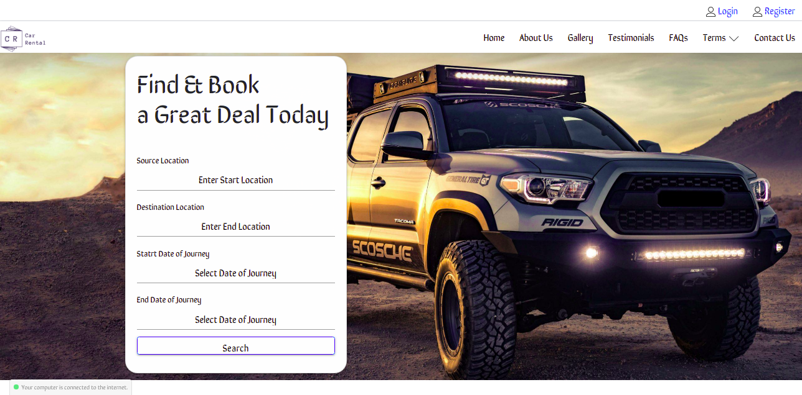

# Capstone Project -> Car Rental

* * *

I have created this **Car Rental** Project because in India there is very less number of websites available for small business owners who are Tours & Travel Agents, I thought to make a Website for those small business owners which can help them to survive & grow in this digital world.

I've used **Cloudinary API** for the Storage of Files (Alternative of AWS S3), **MAPBOX - Distance Matrix API** to find the Distance between two given points, and **HERE GeoCoding API** to convert the Location into **Longitude & Latitude** . Also, I've used the Django's in-built **send_mail()** function to Send Email to the registered user on successful booking of the car, it'll also send Account Creation, Forgot Password Email as well.

## Detail about routes

| **Route Name** | **purpose of Route** |
| :-: | :-: |
| `Route Details for account app` |
| `-----------------------------` |
|   login    | to login to the app |
|   register | to register to the app |
|   change_password    | to login to the app |
| `Route Details for agentDashboard app` |
| `-----------------------------` |
|   agBkgDet    | Agent's Dashboard |
|   addcar | Add Cars to the Portal |
|   adddriver    | Add Driver to the portal |
| `Route Details for carrental app` |
| `-----------------------------` |
|   index    | Home Page |
|   viewcar | view particular car |
|   searchcar    | view all car |
|   checkout    | Checkout for selected car |
|   thankyou | Booking Confirmation page |
|   gallery    | Images of the Car |
|   testimonial    | Customer Feedbacks |
|   faq | FAQ for booking of car |
|   terms-conditions    | T&C of the Company |
|   privacy-policy    | PP of the Company |
|   contactus | Contact Details of the company |
| `Route Details for clientDashboard app` |
| `-----------------------------` |
|   myprofile    | Profile of the registered user |
|   mybookings | all the bookings of the user |
|   detmybookings    | check particular booking |
|   delAcc    | to delete profile |

